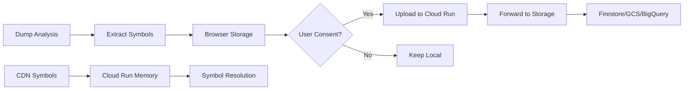

# Cloud Symbol Architecture for BSOD Analyzer

## Problem
Cloud Run is stateless - containers can be destroyed/recreated at any time, so we can't store persistent data.

## Recommended Solution: Hybrid Approach

### 1. **Static Symbol Database (Primary)**
- Pre-built symbol database hosted on CDN (GitHub Pages, jsDelivr, or Cloud Storage)
- Updated periodically with known symbols
- Loaded once per Cloud Run instance
- No persistence needed

```typescript
// On app initialization
await CDNSymbolDatabase.loadSymbols();

// During analysis
const symbol = CDNSymbolDatabase.resolveSymbol('ntoskrnl.exe', 0x12345);
```

### 2. **Client-Side Collection (Optional)**
- Symbols collected in browser (IndexedDB)
- User controls when/if to share
- No automatic uploads
- Privacy-preserving

```typescript
// In analyzer
BrowserOnlySymbolCollector.collectLocally(dumpData);

// User-initiated
const stats = await BrowserOnlySymbolCollector.getStatistics();
// "You have 47 symbol sets ready to share. Upload?"
```

### 3. **Symbol Submission Endpoint**
- Cloud Run endpoint receives batched symbols
- Forwards to persistent storage (not stored on Cloud Run)
- Options:
  - Firestore (best for queries)
  - Cloud Storage (best for bulk data)
  - BigQuery (best for analytics)
  - External API

## Implementation Steps

### Step 1: Create Static Symbol Database
```bash
# Build symbol database from public sources
npm run build-symbols

# Output: public/symbols/
# - symbols.json (main database)
# - symbols.min.json (compressed)
# - version.json (for updates)
```

### Step 2: Host on CDN
```yaml
# GitHub Actions workflow
name: Update Symbol Database
on:
  schedule:
    - cron: '0 0 * * 0' # Weekly
jobs:
  update-symbols:
    steps:
      - name: Build symbols
        run: npm run build-symbols
      - name: Deploy to GitHub Pages
        uses: peaceiris/actions-gh-pages@v3
```

### Step 3: Cloud Run Integration
```javascript
// server.js
app.post('/api/symbols/submit', async (req, res) => {
    // Don't store anything locally
    const { batch } = req.body;
    
    // Option 1: Forward to Firestore
    if (process.env.FIRESTORE_ENABLED) {
        await firestore.collection('symbols').add({
            batch,
            timestamp: new Date(),
            processed: false
        });
    }
    
    // Option 2: Append to Cloud Storage
    if (process.env.GCS_BUCKET) {
        const file = bucket.file(`symbols/${Date.now()}.jsonl`);
        await file.save(JSON.stringify(batch));
    }
    
    res.json({ success: true });
});
```

### Step 4: Privacy-First UI
```typescript
// React component
function SymbolConsent() {
    return (
        <Dialog>
            <h3>Help Improve Symbol Resolution</h3>
            <p>
                Share anonymous symbol data to help everyone get better crash analysis.
                
                What we collect:
                ✓ Function names from crashes
                ✓ Module names (no paths)
                ✓ Crash patterns
                
                What we DON'T collect:
                ✗ Personal information
                ✗ File paths
                ✗ System identifiers
            </p>
            <Button onClick={enableCollection}>
                Yes, help improve the tool
            </Button>
        </Dialog>
    );
}
```

## Data Flow



## Storage Options Comparison

| Option | Pros | Cons | Best For |
|--------|------|------|----------|
| **CDN Static** | Fast, free, no backend | Manual updates | Core symbols |
| **Firestore** | Real-time, queryable | Cost at scale | Live updates |
| **Cloud Storage** | Cheap, unlimited | Not queryable | Bulk archive |
| **BigQuery** | Analytics, SQL | Higher cost | Analysis |
| **External API** | Full control | Another service | Advanced features |

## Privacy & Compliance

1. **Opt-in Only**: No automatic collection
2. **Anonymous**: No user identification  
3. **Transparent**: Show what's collected
4. **User Control**: Export/delete anytime
5. **Local First**: Process in browser
6. **Batch Upload**: User-initiated

## Cost Optimization

- Static symbols from CDN: **FREE**
- Cloud Run: Only pays for API calls
- Storage: 
  - Firestore: ~$0.18/GB/month
  - Cloud Storage: ~$0.02/GB/month
  - BigQuery: ~$0.02/GB/month + queries

## Recommended Architecture

```
┌─────────────────┐     ┌──────────────────┐
│                 │     │                  │
│  Static Symbols │     │  User Browser    │
│  (CDN/GCS)      │     │  - IndexedDB     │
│                 │     │  - Consent UI    │
└────────┬────────┘     └────────┬─────────┘
         │                       │
         ▼                       ▼
┌─────────────────────────────────────────┐
│           Cloud Run (Stateless)         │
│  - Loads static symbols on startup      │
│  - Receives symbol submissions          │
│  - Forwards to persistent storage       │
└─────────────────┬───────────────────────┘
                  │
                  ▼
         ┌────────┴────────┐
         │                 │
    ┌────▼───┐      ┌─────▼────┐
    │Firestore│      │ BigQuery │
    │(Live)   │      │(Analytics)│
    └─────────┘      └──────────┘
```

This architecture:
- Works with Cloud Run's stateless nature
- Provides fast symbol resolution
- Respects user privacy
- Scales efficiently
- Keeps costs low