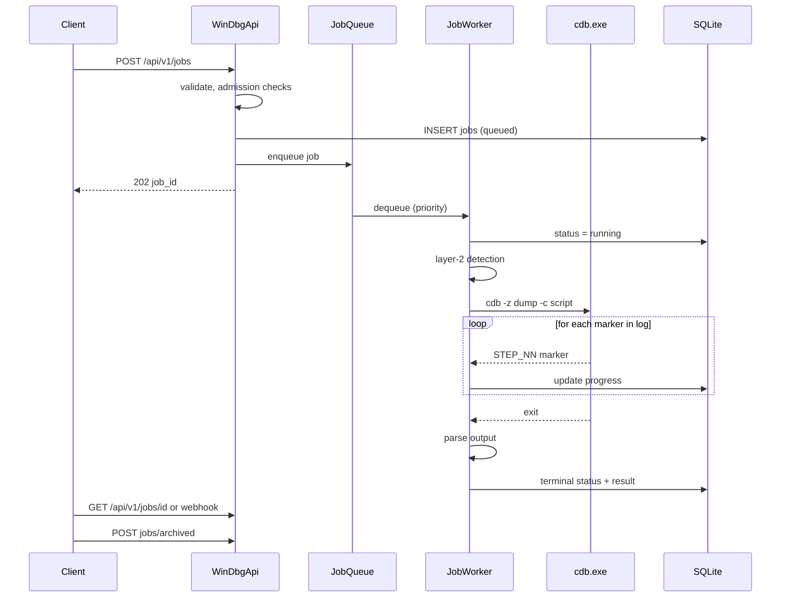
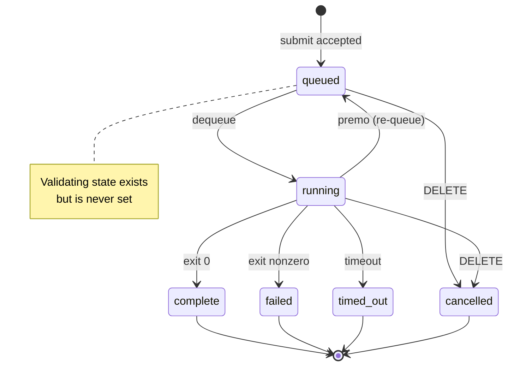

# Dump processing pipeline — end to end

> Source of truth: `WinDbgApi/HostedServices/JobWorkerService.cs` (worker),
> `WinDbgApi/Services/JobQueueService.cs` (queue), `WinDbgApi/Engine/*` (detection,
> cdb, tailing, weights), `WinDbgApi/HostedServices/{WatchdogService,ResultCompactionService,StorageMaintenanceService}.cs`,
> `WinDbgCore/Parsing/{CdbCaptureParser,CrashSignalBuilder}.cs`. Describes behavior as
> implemented — see [known gaps](known-gaps.md). On conflict, code wins.

This page is the definitive answer to "what exactly happens to an uploaded dump",
from HTTP POST to pruned archive.

## End-to-end overview



## Stage 1 — Ingestion

Two entry points share the same submit pipeline (`JobEndpoints.SubmitAsync`):

- **Direct multipart** (`POST /api/v1/jobs`): the file is written to
  `{DUMPS_PATH}/{guid:N}/{sanitized-filename}`; the directory is deleted if any
  validation rejects the job.
- **tus resumable** (`/api/v1/uploads`): chunks are seeked straight into
  `{DUMPS_PATH}/_uploads/{id}.part` (never buffered whole in RAM). On
  `POST /api/v1/uploads/{id}/commit` the file is copied to
  `{DUMPS_PATH}/{id}/{id}.dmp`; if it is an archive (`.zip .7z .gz .tar .rar`),
  `WinDbgApi/Services/ArchiveExtractor.cs` extracts with SharpCompress under
  zip-bomb guards (512 MB total / 5 000 entries / 256 MB per entry, path-traversal-
  safe output names) and promotes the inner dump to `{id}.dmp`.

## Stage 2 — Admission checks (in order)

All in `JobEndpoints.SubmitAsync`; any failure is a 4xx before anything is queued:

1. **Mode / path / priority / profile** — `mode` must match the dump type, `path`
   must resolve under `DUMPS_PATH` (server-local paths are admin-only for cookie
   principals), `priority` ∈ 1..3, `profile` ∈ `kernel|user|dotnet` and compatible
   with the dump type. Unrecognized dump magic → 400.
2. **Storage pressure gate** — projected per-volume usage must stay under
   `Storage:HighWatermarkPercent` (90) with the new bytes included; otherwise the
   submission is rejected **507** (a cleanup sweep runs first).
3. **Queue depth** — non-Premo submissions are rejected **429** (`Queue
   full`) when `Queue:MaxQueueDepth` (50) queued jobs exist. Priority 1 bypasses the
   cap.
4. **Per-key rate limit** — every `api_key_limits` rule for the submitting key must
   pass. Check + log happen atomically in one transaction
   (`SqliteRateLimitStore.TryLogSubmissionAsync`) so concurrent submissions cannot
   slip past; queue-full rejections do **not** consume quota.
5. **Insert + enqueue** — `JobRecord` row inserted (`api_key` stored as digest,
   `owner_user_id` for cookie users), job enqueued in memory. If a job is already
   running and this submission is priority 1, preemption is triggered
   ([Stage 4](#stage-4--queueing-and-priority)).

## Stage 3 — Dump type detection

**Layer 1 — magic bytes** (`WinDbgApi/Engine/DumpTypeDetector.cs`, at submit):

| Magic | dump_type |
|---|---|
| `PAGEDU64` | `kernel` |
| `PAGEDUMP` (32-bit) | rejected (unsupported) |
| `MDMP` | `userminidump` |
| `PGCD` or `!FastSerialization` | `netgcdump` |

**Layer 2 — in-worker refinement** (before cdb analysis runs):

- `WinDbgApi/Engine/ClrDetector.cs` — for `MDMP` only: a cheap cdb probe
  (`lm m clr; lm m coreclr; lm m mscorwks; q`, 15 s cap, local symbol cache only).
  A positive module-table row upgrades the profile to `dotnet` (variant `dotnet`),
  which swaps in the CLR command chain.
- `WinDbgApi/Engine/KernelDumpClassifier.cs` — for kernel dumps: a cdb probe (`q`,
  15 s cap) whose banner distinguishes `kernel-mini` (Small/Unknown) from
  `kernel-full` (Kernel/Full/Automatic) — the full variant's chain adds `.exr -1` /
  `.cxr -1`.
- A client-supplied `profile` overrides the detected profile/variant (but never the
  dump-type routing). Persisted: `detected_profile`, `variant_key`.

`JobStatus.Validating` exists but is never set — see [known gaps](known-gaps.md).

## Stage 4 — Queueing and priority

`WinDbgApi/Services/JobQueueService.cs` keeps an in-memory `SortedSet` ordered by
`(priority asc, submitted_at asc, jobid)`. SQLite `jobs` is the source of truth: on
startup, running jobs are re-queued (`status='queued'`, `started_at=NULL`) and the
queue is rehydrated — a reboot never loses a job. Exactly **one** cdb.exe runs at a
time (atomic hand-off in `RunCoordinator`).

- **Priority 1 — Premo**: kills the currently running cdb.exe process tree
  (`KillProcessTree`), re-queues the interrupted job at its original
  priority/submitted_at (it resumes later from the front), and starts immediately.
- **Priority 2 — Normal**: FIFO.
- **Priority 3 — Pleb**: if ≥ `Pleb:BusyThreshold` (10) jobs completed in the last
  hour, waits `Pleb:DelaySeconds` (60) — and yields to any higher-priority arrival
  that lands meanwhile.

Cancellation (`DELETE /api/v1/jobs/{id}`) removes a queued job or kills a running
one; a job already terminal answers **409**.

## Stage 5 — cdb execution

`WinDbgApi/Engine/CdbProcessRunner.cs`:

- Invocation: `cdb -z {dump} -c {script} -loga {log}` — arguments built with
  `ArgumentList` (no shell quoting issues). The script is generated by
  `WinDbgApi/Engine/CommandChainBuilder.cs` from `engine.commandChains[variantKey]`
  (with fallback to the bare profile prefix, e.g. `kernel-mini` → `kernel`): before
  each command it emits `.echo ==CDBSEC:{token}:STEP_NN_{name}==`, ends with `q`.
- The marker token is random per run, so a marker only counts when it matches this
  run's token (protects against cdb echoing the script back).
- Symbols: `_NT_SYMBOL_PATH` and `_NT_ALT_SYMBOL_PATH` are set to `SYMBOL_PATH`
  (default `srv*C:\Symbols*https://msdl.microsoft.com/download/symbols`).
- cdb's stdout is redirected and discarded — the real output is the `-loga` file.
  stderr is drained and hard-capped at 1 MB.
- Hard rules (do not change, see contract): never `-g`/`-G` with live targets; never
  `<`/`>` inside `.echo` markers; `==CDBSEC:label==` format only.
- The child PID is published on start so premo/cancel/watchdog can kill the whole
  tree. On timeout the tree is killed (`Kill(entireProcessTree: true)`) and the tailer
  is drained twice with a 50 ms gap.

Streaming: `WinDbgApi/Engine/LogFileTailer.cs` watches the `-loga` file
(`FileSystemWatcher` + 50 ms poll timer, byte-level seek-and-read) and emits each
marker to the progress sink. Output caps: 8 MB raw stdout, 2 MB per section
(`CdbOutputAccumulator`).

## Stage 6 — Progress reporting

`WinDbgApi/Engine/ConfigStepWeightProvider.cs` maps each `STEP_*` to a weight from
`engine.stepWeights[variantKey]` (default 5); cumulative percent = completed weight /
total chain weight. `WinDbgApi/Services/DbProgressSink.cs` persists
`current_step`/`progress_pct` and fans out SignalR `job-updated`, throttled to one
update per 200 ms (≤5/s). The dashboard's job-detail page subscribes live; other
pages poll ([dashboard guide](dashboard-guide.md)).

## Stage 7 — Timeouts and watchdog

Three layers, innermost first:

1. **Engine**: `MAX_JOB_DURATION` (360 s) cancels the linked CTS → tree killed →
   job `timed_out`.
2. **Backstop**: `MAX_JOB_DURATION + Queue:AsyncBackstopExtraSeconds` (390 s)
   `Task.WaitAsync` — a `TimedOutSentinel` finishes the job if the CTS path wedged.
3. **Watchdog** (`WinDbgApi/HostedServices/WatchdogService.cs`): every
   `Queue:WatchdogIntervalSeconds` (30 s), any job `running` longer than
   `MAX_JOB_DURATION + Queue:WatchdogGraceSeconds` (420 s) is marked `timed_out`
   with `error_category = watchdog`; if it is the live job its tree is killed and
   `WorkerState.StuckJobsKilled` increments. Watchdog timeouts send no webhook.

A crashed worker never wedges the queue: any unhandled fault logs, emails the admin,
bumps `worker_restarts`, and restarts the worker after
`Queue:WorkerRestartDelaySeconds` (2 s).

## Stage 8 — Outcome precedence and result

`JobWorkerService.ProcessItemAsync` resolves the outcome in this order:

1. Already terminal (cancel/watchdog won) → publish state only.
2. Premo-interrupted → re-queue with original priority/submitted_at, reset
   started_at/step; no webhook.
3. Timeout → `timed_out`, error `Exceeded {N}s timeout`, category `timeout`.
4. Non-zero exit with no output → `failed`, category `cdb`.
5. Otherwise → `complete` (progress 100; partial output still counts; `.gcdump`
   gets `failure_reason = "unsupported_format"`).

The persisted result JSON:

```json
{
  "timed_out": false,
  "exit_code": 0,
  "stdout": "...",
  "stderr": "...",
  "sections": { "STEP_02_analyze_v": "!analyze -v output", "...": "..." },
  "parsed": { "target_info": {}, "modules": [], "stack_frames": [], "...": {} },
  "ai_signal": { "schema": "windbg_crash_signal_v1", "...": {} }
}
```

- `sections` — raw text per command, keyed by sanitized step name.
- `parsed` — structured fields from `WinDbgCore/Parsing/CdbCaptureParser.cs`
  (target/process info, modules, registers, stack frames, exceptions, threads).
- `ai_signal` — `WinDbgCore/Parsing/CrashSignalBuilder.cs` builds
  `windbg_crash_signal_v1`: bugcheck name/code/params, crash bucket, symbol/module/
  image/version/process, up to 16 stack frames, 8 threads, registers, and section
  excerpts. Clients should consume this first ([client integration](client-integration.md)).

## Stage 9 — Persistence and lifecycle

The terminal row is written conditionally (`UpdateJobIfStatusAsync` from `running`),
then the final progress frame is published, then the webhook is enqueued, then the
admin email fires on failure. `jobs.result` is stored as a zstd BLOB by default —
lifecycle from here (compaction, archive ack, prune, reclaim) is documented in
[schema → Result storage](schema.md#result-storage) and
[schema → Retention](schema.md#retention-and-space-reclaim).

## Stage 10 — Webhooks

If the submission carried `callback_url`, `WinDbgApi/Services/WebhookDispatcher.cs`
drains `webhook_deliveries` every 5 s (batch 50): POST with a 10 s timeout, up to
`Webhook:MaxAttempts` (3) with `Webhook:RetryDelaySeconds` (30) backoff. SSRF defense:
URLs are pre-validated (DNS resolution; loopback, private, CGNAT, link-local ranges
blocked) and re-resolved/re-validated at connect time via a `ConnectCallback`.

## Job state diagram



## Related

- [API reference](api-reference.md) — endpoints and result payload
- [Schema](schema.md) — rows written by each stage
- [Client integration](client-integration.md) — how consumers ride this pipeline
